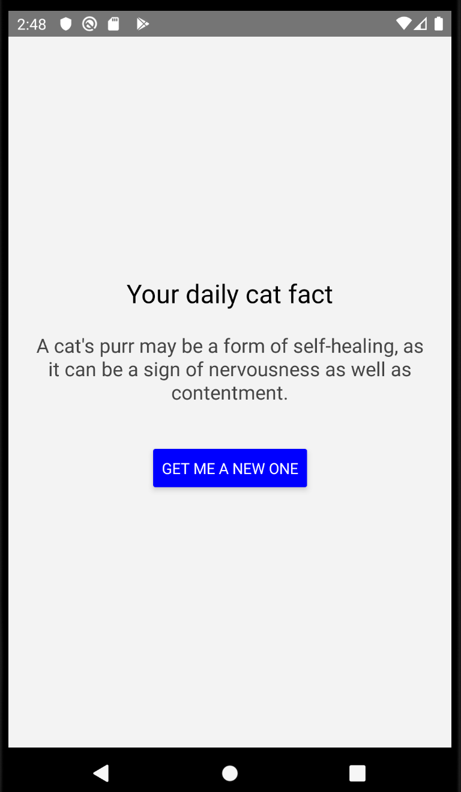

### Introduction

Testing networking logic in React Native apps can be hard. You don't want to bombard the production API everytime you run tests, so you need to mock network calls. Mocking is a good idea also because you want to test not only the happy-land case where everything works smoothly but also the case where the API breaks horribly.

There are different ways to inject the mocks into your app. You could use dependency injection to inject "fetch as a service" into your components or you could use [Context](https://reactjs.org/docs/context.html). Both of these solutions can work well, but they can also get quite messy.

In this post, we are going to build a simple React Native application that's tested in end-to-end fashion with mock data served by [unmock](https://www.unmock.io). Unmock is a [nock](https://github.com/nock/nock)-like library using [node-mitm](https://github.com/moll/node-mitm) behind the scenes to intercept all calls made by your app. It either returns fake data adhering to the schema of the API or, in case it encounters an unexpected call, raises an error.

We'll run our tests in Node.js environment using [Jest](https://jestjs.io/), with [react-native-testing-library](https://github.com/callstack/react-native-testing-library) used to render the app component, React hooks included.

You can find the repository for this project [here](https://github.com/unmock/unmock-react-native-example). Instructions for running the app are contained in the repository.

### Tour of the app

The [example application](https://github.com/unmock/unmock-react-native-example) shows a random cat fact fetched from the [Cat Facts API](https://alexwohlbruck.github.io/cat-facts/). User can refresh the fact by pressing the button. The app in all its glory looks like this, running here in Android virtual device:

<p align="center">

</p>

Code for the app contains a single component defined in [App.tsx](https://github.com/unmock/unmock-react-native-example/blob/master/src/App.tsx). In brief, the component is defined as follows:

```ts
const App = () => {
  /* React hooks */
  const [shownFact, setFact] = useState('');
  const [err, setError] = useState(null);
  const [loading, setLoading] = useState(false);

  /* Refresh cat fact, see below */
  const refreshFact = async () => {
    /* */
  };

  /* Initial data fetching */
  useEffect(() => {
    refreshFact();
  }, []);

  return (
    /* JSX, see below */
  );
};
```

The component uses `useState` from React hooks for state management. The variables `shownFact`, `err`, and `loading` are used to contain the shown fact, possible fetch error, and the loading state, respectively.

Refreshing the shown fact at start-up or when user presses the button is made via `refreshFact` function defined in `App`:

```ts
const refreshFact = async () => {
  try {
    setLoading(true);
    const fact = await fetchFact();
    setFact(fact);
    setError(null);
  } catch (err) {
    setError(err);
  } finally {
    setLoading(false);
  }
};
```

The function `fetchFact` does the network call using the [Fetch API](https://facebook.github.io/react-native/docs/network) provided by React Native:

```ts
const CAT_FACT_URL =
  'https://cat-fact.herokuapp.com/facts/random?animal_type=cat&amount=1';

const fetchFact = async () => {
  const fetchResult = await fetch(CAT_FACT_URL);
  if (!fetchResult.ok) {
    throw Error(`Failed fetching cat fact with code: ${fetchResult.status}`);
  }
  const body = await fetchResult.json();
  const fact = body.text;
  return fact;
};
```

The response body is a JSON object with the cat fact contained in `text` field, shown [here](https://alexwohlbruck.github.io/cat-facts/docs/endpoints/facts.html).

Content is rendered based on the values of `loading` and `err`:

```jsx
{
  loading ? (
    <Text style={styles.loading} testID="loading">
      Loading...
    </Text>
  ) : err ? (
    <Text style={{...styles.fact, ...styles.error}} testID="error">
      Something went horribly wrong, please try again!
    </Text>
  ) : (
    <Text style={styles.fact} testID="fact">
      {shownFact}
    </Text>
  );
}
```

If the state of `loading` is `true`, we show the text "Loading...". If the state of `err` contains an error, apology is shown to the user. Otherwise, the cat fact is rendered.

Note that we also give the components [testID](https://facebook.github.io/react-native/docs/view#testid) properties to simplify testing.

### Conclusion

Note that `unmock` currently only supports Node.js environment (which is the one we use). If you want to see Unmock run in React Native and populate your app with fake data, maybe create an issue in [unmock-js](https://github.com/unmock/unmock-js) repository!
